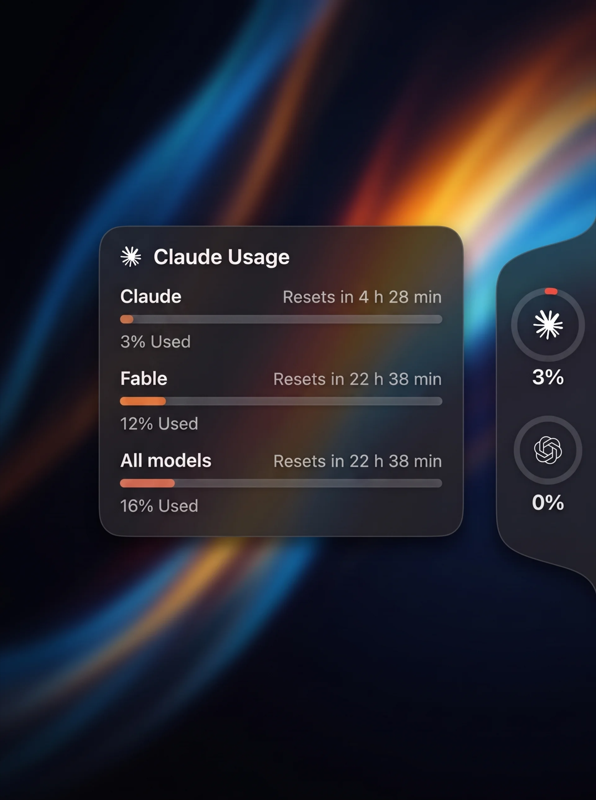

# Brink

[](https://github.com/semihtalii/brink/actions/workflows/ci.yml)
[](https://github.com/semihtalii/brink/releases/latest)
[](#requirements)
[](LICENSE)

**Know when you're on the brink.** A tiny macOS panel that lives on the right
edge of your screen and shows your **Claude Code** and **Codex** usage limits
at a glance.

Move the mouse to the thin strip on the right edge → the panel slides out.
Hover a ring → a card shows the session limit, weekly limits and reset times.

No Dock icon, no menu bar clutter. Just the edge.

<p align="center">
  
</p>

## Features

- Three looks: **Black**, **Liquid Glass** and **System**. On macOS 26+ the glass is
  Apple's real, adaptive Liquid Glass (`.glassEffect`): it turns light or dark from
  what's behind it, so type stays legible over a white web page and a dark wallpaper
  alike. On macOS 13–15 it falls back to a frosted `NSVisualEffectView` blur.
- Notch-style tab that flares into the screen edge; rings scale on hover; the detail card glides between rings
- **Notifications** when a limit fills up — and again the moment it resets (scheduled for the reset time, so it arrives even if the app is idle)
- **10 languages** — follows your macOS language automatically (English, Türkçe, Deutsch, Français, Español, Português (Brasil), Italiano, 日本語, 简体中文, 한국어); override in the menu
- Rings for each provider, colored by usage (green → yellow → red; Claude ring in Claude orange)
- Detail card with **Current session**, **All models** and per-model weekly limits (e.g. Fable / Opus / Sonnet)
- Auto-refresh every 2 minutes, manual refresh from the context menu
- **Launch at login** toggle (System Settings → Login Items compatible)
- Works with whatever CLIs you already have installed — no API keys, no accounts

## Requirements

- macOS 13 Ventura or later
- [Claude Code](https://docs.anthropic.com/en/docs/claude-code) and/or [Codex CLI](https://github.com/openai/codex), logged in
- To build from source: Xcode Command Line Tools (`xcode-select --install`)

## Install

### Download

Grab `Brink.dmg` from the [latest release](../../releases/latest), open it and
drag **Brink** to **Applications**.

The app is not yet notarized. On first launch macOS will complain about an
unidentified developer: **right-click → Open**, or allow it in
*System Settings → Privacy & Security*.

### Build from source

```bash
git clone https://github.com/semihtalii/brink.git
cd Brink
./build.sh
open dist/Brink.app
```

`build.sh` produces both `dist/Brink.app` and `dist/Brink.dmg`.

## First launch

macOS will ask once:

> *Brink wants to use your confidential information stored in "Claude Code-credentials" in your keychain.*

Click **Always Allow**. This is Claude Code's own login token; Brink reads it
to ask Anthropic for your usage numbers. It is never sent anywhere else.

## Usage

| Action | Result |
|---|---|
| Move mouse to right edge | Panel slides out |
| Hover a ring | Detail card |
| Right-click panel or card | **Refresh now** · **Appearance** · **Language** · **Launch at login** · **Notifications** · **Test notification** · **Quit Brink** |
| Move the mouse far from the edge | Panel folds away by itself |

If a CLI is not installed or not logged in, its ring shows **DEMO** data so you
can still see the UI.

## How it works

- **Claude** — reads the OAuth access token Claude Code stores in the macOS
  Keychain (`Claude Code-credentials`) or in `~/.claude/.credentials.json`, then
  calls `api.anthropic.com/api/oauth/usage` — the same request Claude Code makes
  for its `/usage` command.
- **Codex** — reads the token in `~/.codex/auth.json` and calls
  `chatgpt.com/backend-api/wham/usage`.

### Security & privacy

- Tokens are only ever sent to Anthropic's / OpenAI's own API hosts over HTTPS.
  There is no telemetry, no third-party server.
- Brink caches only the **short-lived access token** and its expiry in
  `~/Library/Application Support/Brink/credentials.json` (mode `0600`) so the
  Keychain prompt appears once rather than every refresh. It never stores or
  uses refresh tokens, and it never refreshes tokens on your behalf — so it
  cannot log you out of Claude Code.
- When the cached token expires, Brink re-reads Claude Code's own store.
  Opening Claude Code once is enough to get a fresh token.

### Caveats

- These usage endpoints are **not official, documented APIs**. If Anthropic or
  OpenAI change the response shape, the parsers in `ClaudeProvider.swift` /
  `CodexProvider.swift` will need a small update. PRs welcome.
- The panel attaches to the main display only (v1).

## When not to use this

- You want numbers inside the terminal or a status line → look at CLI tools such as
  [llmquota](https://github.com/0xNyk/llmquota) or [ccusage](https://github.com/ryoppippi/ccusage).
- You need token-level cost accounting → this only shows the percentage windows
  the vendors expose.
- You're on Linux/Windows → Brink is macOS-only (NSPanel + Keychain).

## How Brink compares

| | Brink | llmquota | ccusage |
|---|---|---|---|
| Form | Edge panel (GUI) | Terminal TUI | Terminal report |
| Providers | Claude Code, Codex | Claude, Codex, Cursor, Grok… | Claude Code |
| Setup | Open the app | Node 22 + npm | Node + npm |
| Needs API key | No | No | No |
| Always visible | Hover the edge | Only while running | Only while running |

## Project layout

```
Package.swift                 Swift Package (macOS 13+)
build.sh                      build → .app + .dmg
Sources/Brink/
  main.swift                  entry point (accessory app, no Dock icon)
  PanelController.swift       edge panel + detail card windows (NSPanel)
  Views.swift                 SwiftUI: rings, strip, detail card
  Models.swift                data model, color scale, refresh store
  Theme.swift                 Black / Liquid Glass / System palettes + blur surface
  LaunchAtLogin.swift         SMAppService wrapper
  Notifier.swift              limit-reached / reset notifications (UserNotifications)
  L10n.swift                  localization lookup + language override
  Resources/                  provider logos, <lang>.lproj/Localizable.strings
  ClaudeProvider.swift        Claude usage source
  CodexProvider.swift         Codex usage source
```

Adding a provider (Cursor, Gemini CLI, …) means implementing the
`UsageProvider` protocol and appending it to the list in `main.swift`.
Adding a language is one file: copy `Resources/en.lproj/Localizable.strings`
to `<code>.lproj/`, translate the right-hand side, and add the code to
`L10n.available` and `build.sh`'s `CFBundleLocalizations`.

For design work or screenshots, `BRINK_PREVIEW=1 dist/Brink.app/Contents/MacOS/Brink`
starts the app expanded with the first card open.

## Credits

The edge-panel design is based on a concept shared by
[@hivinz_](https://x.com/hivinz_) —
[original post](https://x.com/hivinz_/status/2092996055248126353).
Brink is an independent, open-source implementation of that idea; all code is
original. Claude and OpenAI logos belong to Anthropic and OpenAI respectively and
are used only to identify each provider.

## License

[MIT](LICENSE) © Semih Tali
